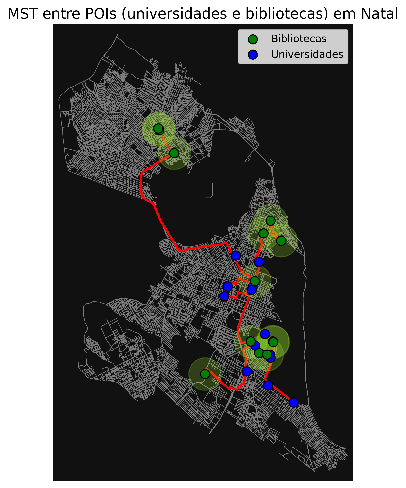
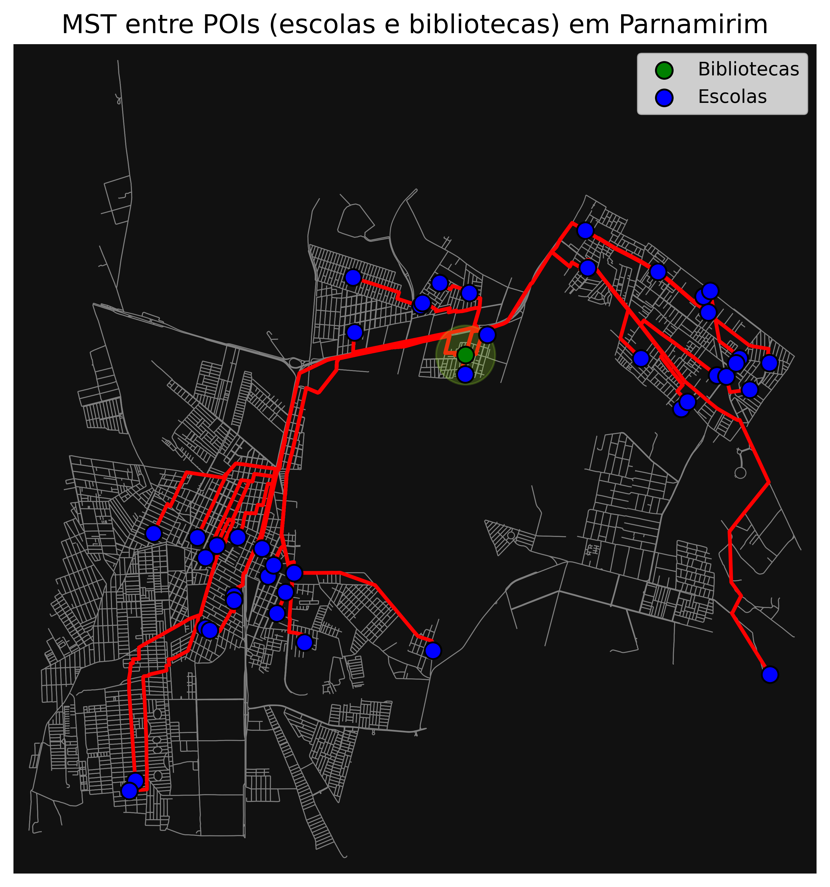
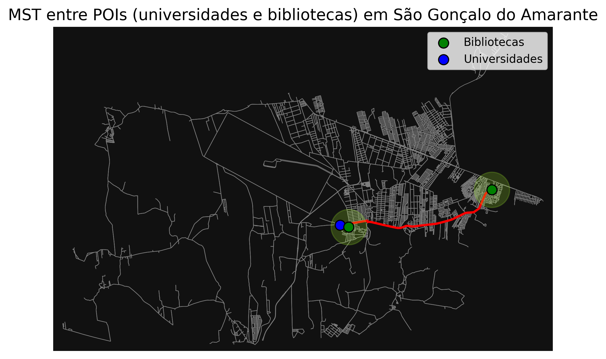
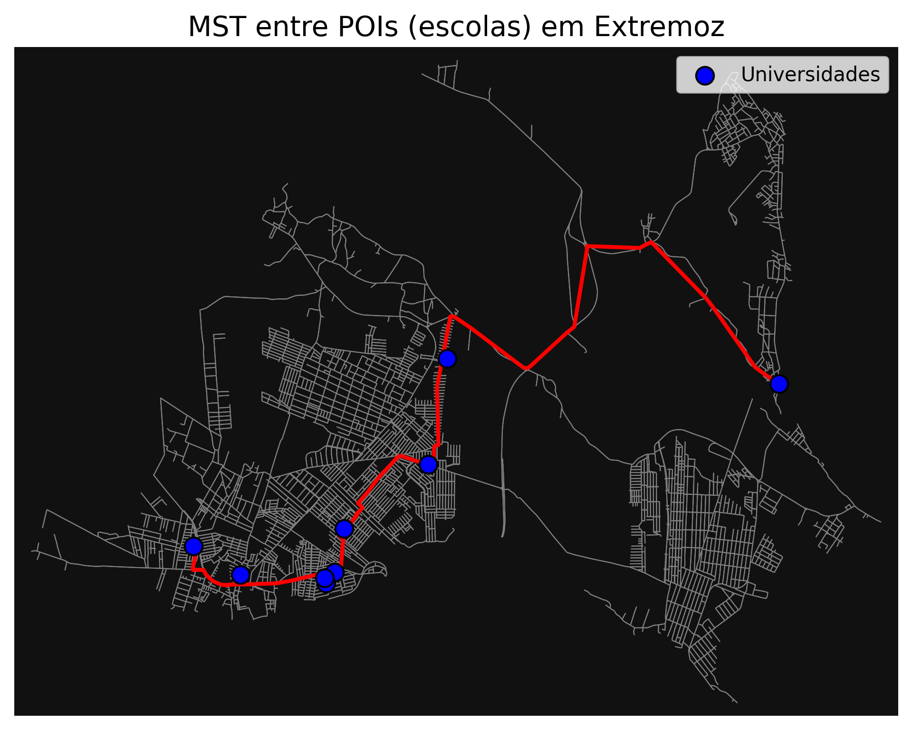
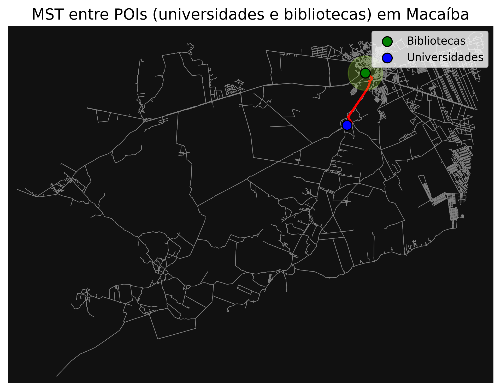
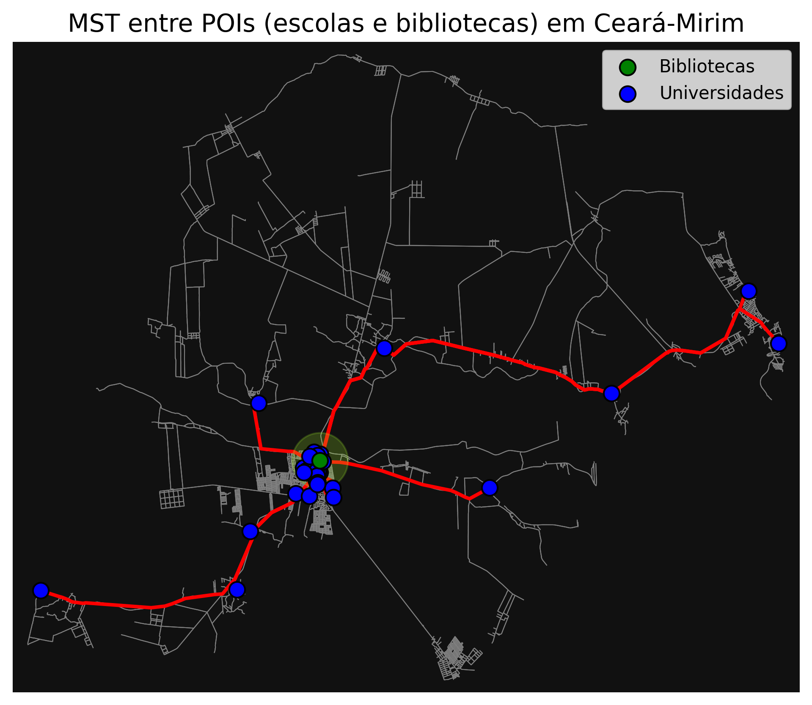
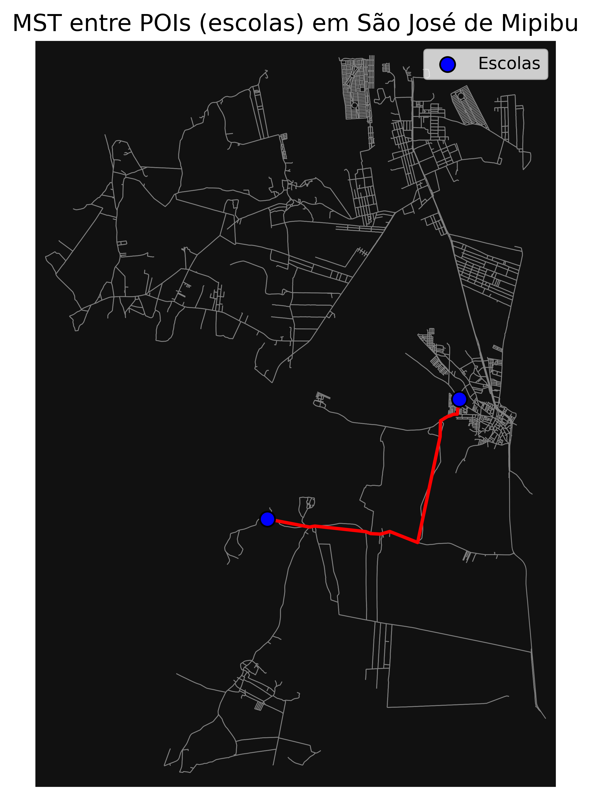
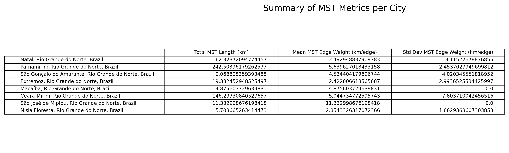

Este projeto vale 3,0 pontos para a Unidade 2.
Dado um conjunto de pontos de interesse (POIs) em uma cidade, estimar quantos quilômetros são suficientes para interligá-los por vias reais.

---

## Objetivos

1) Modelar o grafo viário da(s) cidade(s) com OSMnx (ou equivalente);  
2) Calcular rotas mais curtas com A\* entre POIs;  
3) Construir e calcular a Árvore Geradora Mínima (MST) sobre o grafo completo entre POIs (arestas ponderadas pelo custo A\* nas vias) para obter o comprimento total mínimo necessário para conectar todos os POIs;  
4) Comparar o resultado com pelo menos 8 cidades.

---

## Como Executar o Projeto

Para executar a análise contida no [notebook](https://https://github.com/lucasumb/Algoritmos-e-estruturas-de-dados-II/tree/main/Projeto03/notebooks), siga os passos abaixo:

**1. Pré-requisitos:**
-   Python 3.x
-   Jupyter Notebook ou Google Colab

**2. Dependências:**
As principais bibliotecas utilizadas são:
-   `osmnx`
-   `networkx`
-   `matplotlib`
-   `pandas`

---

## Resultados

Eu decidir por analisar as cidades proximas a cidade em que vivo. Com isso, temos as cidades de:

- Natal, Rio Grande do Norte, Brazil
- Parnamirim, Rio Grande do Norte, Brazil
- São Gonçalo do Amarante, Rio Grande do Norte, Brazil
- Extremoz, Rio Grande do Norte, Brazil
- Macaíba, Rio Grande do Norte, Brazil
- Ceará-Mirim, Rio Grande do Norte, Brazil
- São José de Mipibu, Rio Grande do Norte, Brazil
- Nísia Floresta, Rio Grande do Norte, Brazil

Começando por Natal, após plotarmos a rede das ruas junto com os nós das universidades e bibliotecas públicas, podemos perceber que os caminhos entre as universidades e bibliotecas são bastante proximas se comparada as outras cidades. Além de ter uma quantidade alta de bibliotecas comparado ao número total de universidades, resultando em 15 bibliotecas e 14 universidades.

Em Parnamirim não foi encontrada nenhuma universidade mas possuia 51 escolas e 1 biblioteca, então decidi por ligar as escolas e bibliotecas, após plotarmos a rede das ruas junto com os nós das escolas e bibliotecas públicas, podemos perceber que devido a ter uma unica biblioteca causou uma maior distancia entre as escolas e a biblioteca. É uma região que poderia ter um maior investimento com bibliotecas públicas para suprir os alunos daquela região.

Em São Gonçalo do Amarante foi encontrada 1 universidades e  2 biblioteca pública, após plotarmos a rede das ruas junto com os nós das universidades e bibliotecas, mesmo com poucas universidades e bibliotecas elas são bem espalhadas e a universidade é bem proxima a biblioteca, o que demostra uma preocupação por fornecer um local para estudos tanto para universitarios como para a população, há uma area que poderia receber uma biblioteca para suprir a necessidade da população, mas teriamos que analisar a demografia desta determianda região.

Em Extremoz foi encontrada 9 universidades mas nenhuma biblioteca públicca, então decidi por ligar apenas as universidades. No geral, as universidades estão bem próximas então caso tivesse uma biblioteca seria bem util para os universitarios de Extremoz. 

Em Macaíba foi encontra 1 universidade e 1 biblioteca pública, resultando em um unico caminho que ligue eles.

Em Ceará-Mirim não foi encontrada nenhuma universidade mas possuia 30 escolas e 1 biblioteca pública, então decidi por ligar as escolas e bibliotecas, após plotarmos a rede das ruas junto com os nós das escolas e bibliotecas públicas podemos perceber está centralizada no meio da rede, ao todo é proxima de bastantes escolas sendo algo bastante positivo. 

Em São José de Mipibu não havia universidades e bibliotecas, possuindo 2 escolas. As escolas são bem distantes entre sí.

Por fim, em Nísia Floresta não havia universidades e bibliotecas, possuindo 3 escolas. As escolas são proximas entre sí, o que seria positivo para se pensar em construir uma biblioteca para suprir a população.

Referente ao resultado das métricas:

- Comprimento total do MST (soma dos pesos das arestas no grafo completo de POIs)
- Média do peso das arestas do MST
- Desvio padrão do peso das arestas do MST
- Comprimento total real da rede formada pelas rotas do MST

### Video explicativo

