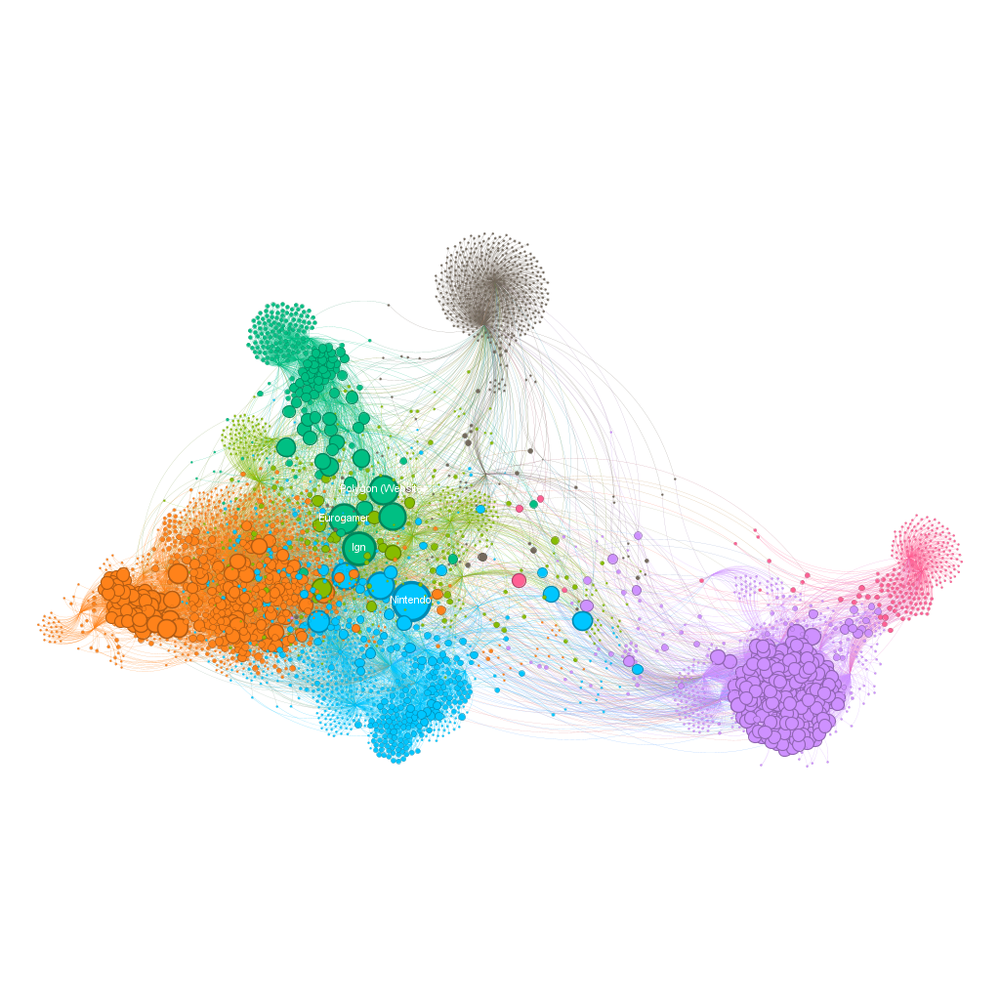
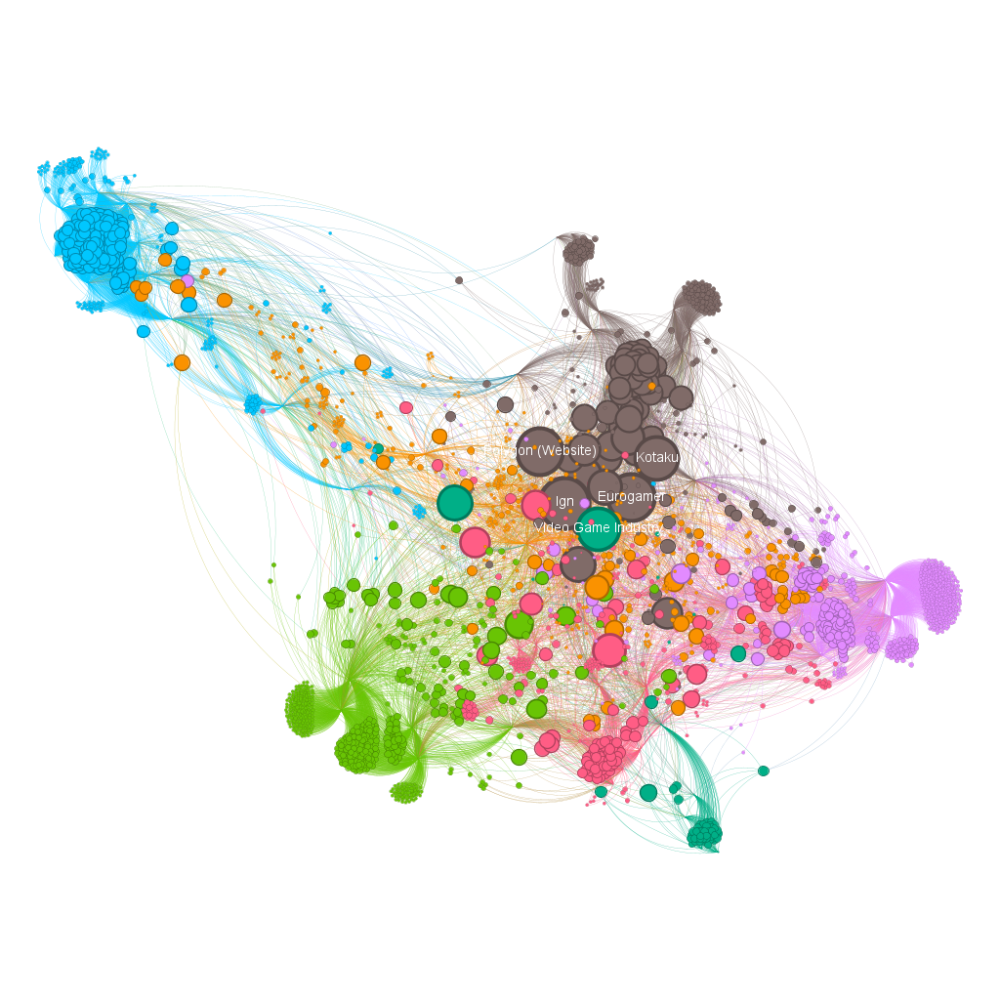
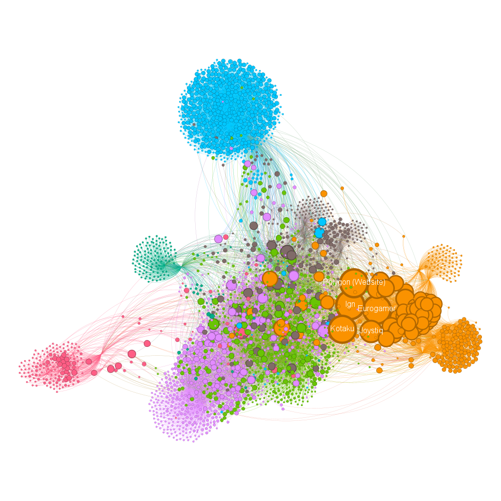
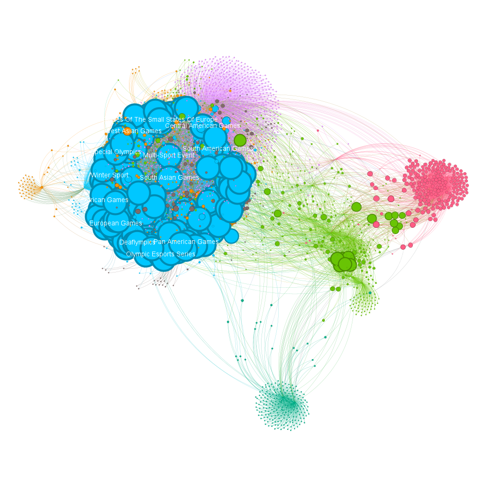
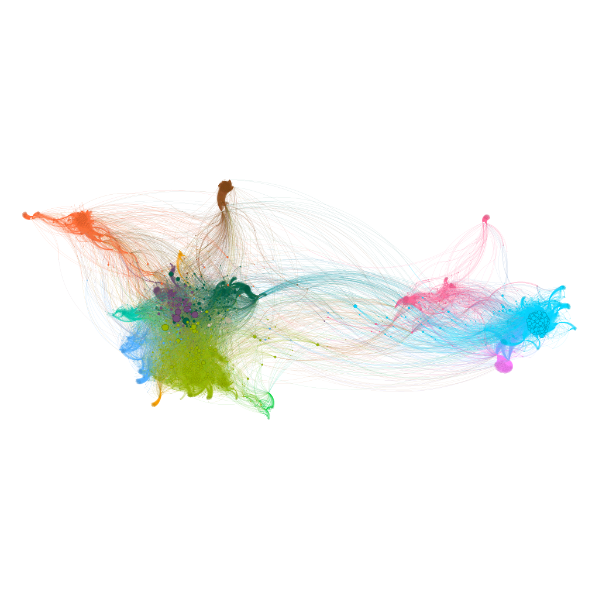
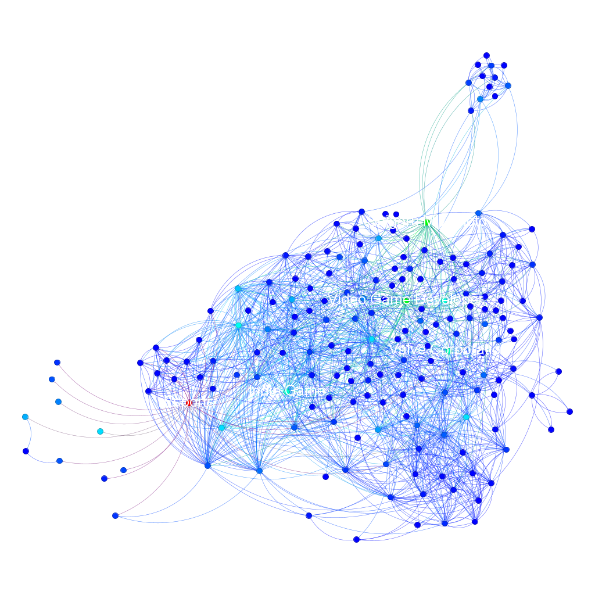
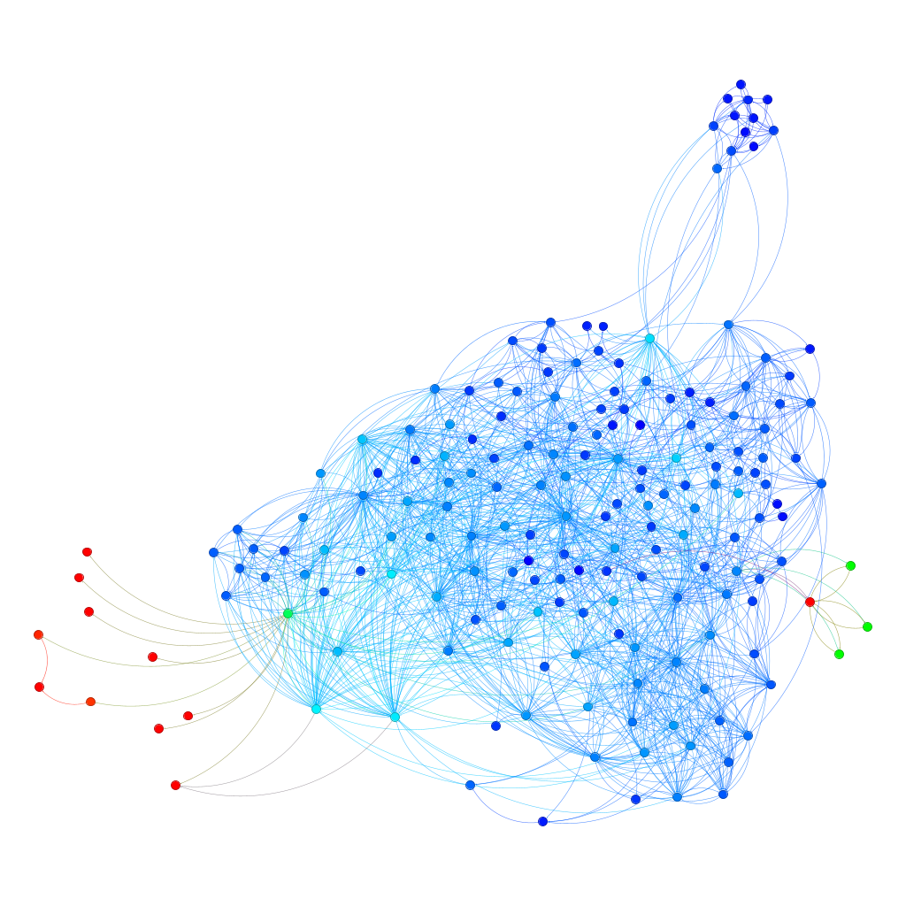
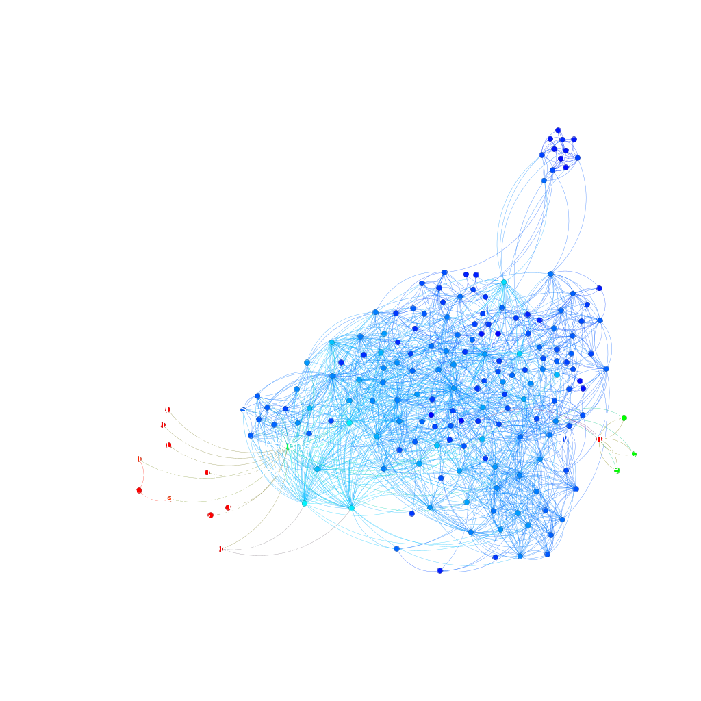
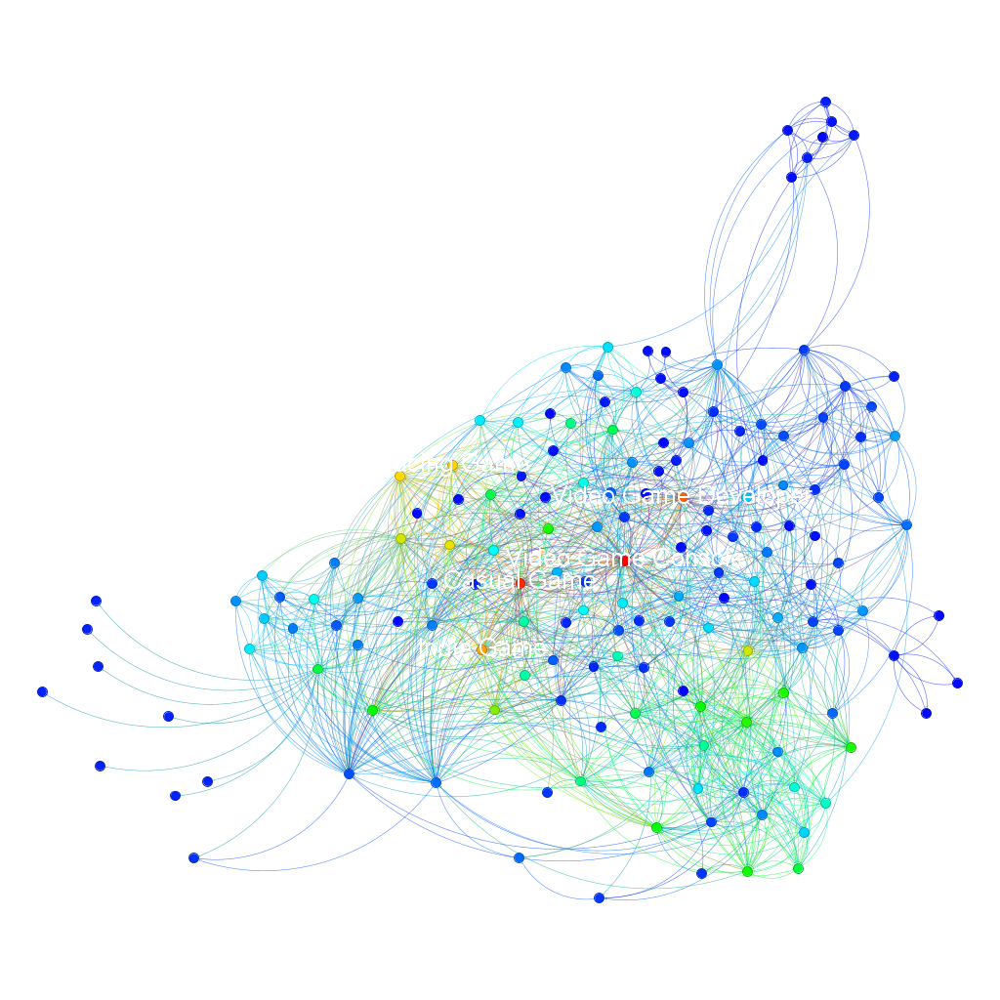
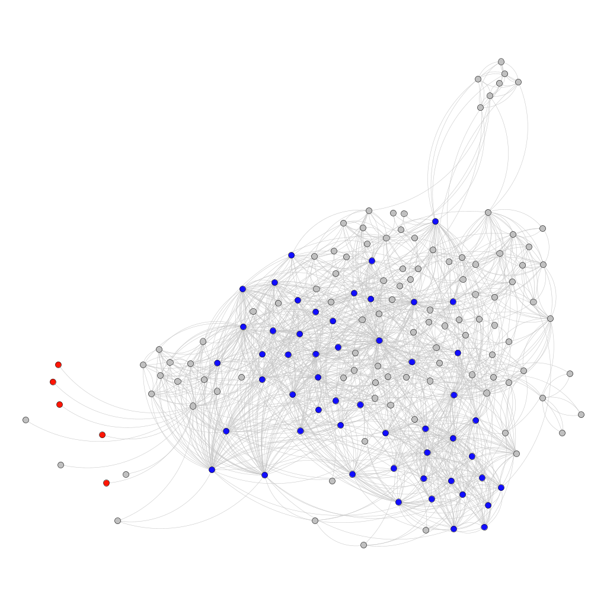

Este projeto vale 4,0 pontos para a Unidade 2 e 10 para a Unidade 3.
Utilizando o Gephi e bibliotecas em python, aplicar os conhecimentos vistos no curso (Semanas 10 e 11) para analisar a rede de estruturas complexas (Estudo de Caso do Wikipedia) a partir de métricas de centralidade e soluções de otimização.

---

## Base de dados

● A base de dados será a rede de links para o Wikipedia construída de forma similar ao apresentado na semana 11.

● A rede será mesclada (fusão de dados) a partir de 5 SEEDs de páginas de assuntos diferentes.

● O algoritmo de procura de links deverá explorar até o nível 2 (altura < 3). Reforçar, que em sala de aula foi feito uma altura inferior ao nível 2 (altura < 2).

---

## Objetivos

**REQUISITO 1**

● A partir da rede construída gerar figuras similares utilizando o Gephi.

● O tamanho do vértice deverá ser proporcional a quantidade de vizinhos. As cores devem ser relacionadas com o Closeness ou Betweenness ou Eigenvector Centrality.

● Adote um layout que seja razoável perceber a diferença entre as cores do vértices. As figuras devem ser acompanhadas de descrições/explicações.

● Pontuação: 4 pontos na Unidade 2.

**REQUISITO 2**

● A partir da rede construída gerar uma figura similar no gephi destacando o k-core e o k-shell da rede. O layout é de livre escolha. Os vértices devem ter um tamanho proporcional a propriedade degree. A figura deverá estar acompanhada de descrição/explicação.

● Pontuação: 3 pontos na Unidade 3.

**REQUISITO 3**

● A rede deverá estar em produção de forma análoga ao explicado na Semana 11. As cores deverão ser relacionadas ao critério de comunidade e o tamanho do vértice a uma métrica de livre escolha.

● Pontuação: 1 ponto na
Unidade 3.

**REQUISITO 4**

● É notório que durante a geração da rede explorar novos links até o nível 2 (altura < 3) irá demandar uma demanda computacional maior. O trabalho irá propor uma heurística e uma estrutura de dados para tornar isso possível.

● Pontuação: 6 pontos na Unidade 3.

---

## Como Executar o Projeto

Para executar a análise contida no [notebook](https://https://github.com/lucasumb/Algoritmos-e-estruturas-de-dados-II/tree/main/Projeto04/notebooks), siga os passos abaixo:

**1. Pré-requisitos:**
-   Python 3.x
-   Jupyter Notebook ou Google Colab

**2. Dependências:**
As principais bibliotecas utilizadas são:
-   `wikipedia`
-   `networkx`
-   `matplotlib`
-   `operator`

---

## Resultados

Para a definição do escopo do trabalho, estabeleceu-se como tema central a Indústria de Jogos. A coleta de dados foi iniciada a partir de cinco Seeds distintas: Shigeru Miyamoto, Valve Corporation, Final Fantasy, Minecraft e Esports.

Para enfrentar o desafio de alta demanda computacional ao explorar a rede até o nível 2 (altura < 3), implementamos uma heurística de priorização. Em vez de uma inserção cega, optei por ranquear os links adjacentes antes de adicioná-los à fila de processamento. Essa abordagem otimizou a coleta, resultando em uma busca focada especificamente em páginas da Wikipedia relacionadas à indústria de jogos.

Indo agora para o Gephi, utilizei para mostrar a rede de cada seed e por fim, a união das seeds. Começando pela seed Shigeru Miyamoto:

Em seguida a seed Valve Corporation:

Em seguida a seed Final Fantasy:

Em seguida a seed Minecraft:

Em seguida a seed Esports:

Em seguida a união de todas as seeds:

Prosseguindo para a análise dos requisitos 1 e 2, observamos na primeira imagem a métrica de Betweenness Centrality. Esta visualização destaca os nós que atuam como pontes controlando o fluxo de informação na rede. O resultado valida a escolha das seeds, pois revela que nós estruturais como 'Video Game Developer' são vitais; sua remoção causaria a desconexão entre os nós, prejudicando severamente a topologia da rede.

Seguindo para Closeness Centrality, vimos que o centro da rede tem alta proximidade ,chegando a qualquer lugar rápido, enquanto os nós vermelhos na "cauda" esquerda estão distantes.

Seguindo para Eigenvector Centrality, ela nos revela a influência real na rede, nós como "Video Game Console" e "Casual Game" aparecem com destaque. Sendo uma referência central dessa rede mesclada.

Por fim, temos o k-core e o k-shell que tivemos um k-core (vermelho) de 25 que contém os assuntos fundamentais e altamente interligados e um k-shell (azul) de 24 que são as "folhas" que citam os conceitos centrais. 

### Video explicativo

* [Parte 1](https://www.loom.com/share/385eabbca9f44998a309ced82e85b149)

* [Parte 2](https://www.loom.com/share/7d9bb70207f44ad9b554a2db2b56f1ff)

